<div align="center">


# 🌴 Waha (واحة)

### *A Real-World Fresh Produce Delivery Ecosystem*

[](https://flutter.dev)
[](https://firebase.google.com)
[](https://bloclibrary.dev)
[](https://blog.cleancoder.com/uncle-bob/2012/08/13/the-clean-architecture.html)

**A production-ready, dual-app mobile ecosystem built with Flutter**  
*Connecting customers with fresh produce vendors in Mansoura, Egypt*

[📱 Customer App](#-customer-app-features) • [🏪 Vendor App](#-vendor-app-control-center) • [🏗️ Architecture](#️-system-architecture) • [📸 Screenshots](#-visual-showcase) • [📞 Contact](#-contact--social-links)

---

</div>

## 📖 The Story

> **This is not a tutorial project. This is a real solution for a real business.**

**Waha** (meaning "Oasis" in Arabic) was born from a genuine need—my friend launched a fresh produce delivery startup in Mansoura, Egypt, and needed a complete digital infrastructure to manage operations at scale.

The challenge was clear: build a system where **customers can browse and order fresh vegetables and fruits**, while **vendors receive instant notifications** to fulfill orders efficiently. The solution needed to handle the complexities of perishable goods—real-time inventory updates, instant order notifications, and seamless communication between two distinct user bases.

What started as helping a friend became a **full-scale production ecosystem**—two interconnected Flutter applications, a Firebase backend handling authentication, real-time data, file storage, and push notifications, all architected for scalability and maintainability.

### 🎯 The Result

A complete **Order-to-Delivery Pipeline** that transforms how local fresh produce businesses operate:

```
Customer Places Order → Instant Push Notification → Vendor Accepts → Status Updates → Delivery
```

---

## 🌐 The Ecosystem

Waha consists of **two distinct applications** that communicate in real-time through Firebase:

<div align="center">

|                  📱 Customer App (Waha)                   |       |               🏪 Vendor App (Waha Store)               |
| :------------------------------------------------------: | :---: | :---------------------------------------------------: |
|  |       |  |
|                 *Shop for fresh produce*                 |       |              *Manage orders & inventory*              |

```mermaid
flowchart LR
    subgraph Customer["📱 Customer App"]
        A[Browse Products] --> B[Add to Cart]
        B --> C[Place Order]
    end
    
    subgraph Firebase["☁️ Firebase Cloud"]
        D[(Firestore)]
        E[Cloud Messaging]
        F[Authentication]
    end
    
    subgraph Vendor["🏪 Vendor App"]
        G[Receive Notification]
        H[Accept/Reject Order]
        I[Update Status]
    end
    
    C --> D
    D --> E
    E --> G
    G --> H
    H --> I
    I --> D
    D --> Customer
```

</div>




### 🔄 Real-Time Synchronization

One of the **biggest technical challenge** was achieving instant, reliable synchronization:

- **Instant Notifications**: When a customer places an order, the vendor receives a push notification *immediately*—even when the app is in background mode
- **Order Status Tracking**: Customers receive live updates as their order progresses through the fulfillment pipeline
- **Offline Resilience**: Firebase's built-in caching allows browsing previously loaded data even without connectivity

---

## 🎬 Demo

<div align="center">


*Watch the complete order flow in action*

</div>

---

## 📱 Customer App Features

The customer-facing application provides a seamless shopping experience:

| Feature                     | Description                                                            |
| --------------------------- | ---------------------------------------------------------------------- |
| 🏠 **Dynamic Marketplace**   | Browse categorized fresh produce with real-time availability           |
| 🔍 **Smart Search**          | Find products quickly with intelligent filtering                       |
| 🛒 **Intuitive Cart**        | Add, remove, and adjust quantities with instant price updates          |
| 📍 **Location Services**     | Automatic GPS-based location detection for accurate delivery addresses |
| 👤 **Social Authentication** | Quick sign-in with Google or Facebook                                  |
| 📱 **Responsive Design**     | Beautiful UI that adapts to any screen size                            |

---

## 🏪 Vendor App Control Center

The vendor/admin application puts business owners in control:

| Feature                      | Description                                        |
| ---------------------------- | -------------------------------------------------- |
| 📊 **Dashboard Overview**     | At-a-glance view of pending orders and daily stats |
| 🔔 **Instant Notifications**  | Never miss an order—background push notifications  |
| ⚡ **Quick Inventory Action** | Toggle visibility & update prices instantly        |
| 📈 **Order History**          | Complete transaction logs for business insights    |

---

## 🏗️ System Architecture

Both apps are built following **Clean Architecture** principles for maximum scalability and maintainability:

> ✨ **Achieved +40% code sharing** between Customer and Vendor apps by modularizing core logic and UI components.

### 📱 Customer App (Waha)

```
waha/lib/
├── 📁 app/
│   ├── 📁 models/           # Data models & entities
│   ├── 📁 functions/        # Core business logic
│   └── 📁 utils/            # Utility functions & helpers
│
├── 📁 features/
│   ├── 📁 authentication/   # Login, signup, social auth
│   ├── 📁 home/             # Main marketplace
│   ├── 📁 product_details/  # Product viewing
│   ├── 📁 cart/             # Shopping cart
│   └── 📁 orders/           # Order tracking
│
├── 📁 navigation/           # Route management
└── main.dart
```

### 🏪 Vendor App (Waha Store)

```
waha_store/lib/
├── 📁 app/
│   ├── 📁 models/           # Data models & entities
│   ├── 📁 functions/        # Core business logic
│   └── 📁 utils/            # Utility functions & helpers
│
├── 📁 features/
│   ├── 📁 authentication/   # Admin login
│   ├── 📁 dashboard/        # Overview & stats
│   ├── 📁 orders/           # Order management
│   ├── 📁 products/         # Inventory control
│   └── 📁 notifications/    # Push notifications
│
├── 📁 navigation/           # Route management
└── main.dart
```

### 🔧 Tech Stack

<div align="center">


</div>

### 📚 Key Dependencies

```yaml
# State Management
flutter_bloc: ^9.1.1

# Firebase Suite
firebase_core: ^3.15.2
firebase_auth: ^5.7.0
cloud_firestore: ^5.6.12
firebase_storage: ^12.4.10
firebase_messaging: ^15.2.10

# Location & Maps
google_maps_flutter: ^2.13.1
geolocator: ^13.0.4
geocoding: ^4.0.0

# Authentication
google_sign_in: ^6.3.0
flutter_facebook_auth: ^7.1.2

# Image Handling
cached_network_image: ^3.4.1

# UI/UX
flutter_svg: ^2.2.1
carousel_slider: ^5.1.1
flutter_screenutil: ^5.9.3
```

---

## 📸 Visual Showcase

### 📱 Customer App

<div align="center">

|                      Home                       |                      Products                       |                      Product Details                       |
| :---------------------------------------------: | :-------------------------------------------------: | :--------------------------------------------------------: |
|  |  |  |

|                      Cart                       |                      Checkout                       |                      Profile                       |
| :---------------------------------------------: | :-------------------------------------------------: | :------------------------------------------------: |
|  |  |  |

|                      Login                       |                      Sign Up                      |                      Location                       |
| :----------------------------------------------: | :-----------------------------------------------: | :-------------------------------------------------: |
|  |  |  |

|                      Who Are We                       |
| :---------------------------------------------------: |
|  |

</div>

### 🏪 Vendor App

<div align="center">

|                      Admin Dashboard                       |
| :--------------------------------------------------------: |
|  |

</div>

---

## 📲 Download

<div align="center">

### Try Waha Customer App


**Scan to download the APK**

*Or download directly from [Releases](https://github.com/Yousef-Sh3ban/Waha-Ecosystem/releases)*

</div>

---
## 🔒 Source Code & Availability

> **Note:** This repository is intended as a **technical showcase**.

As **Waha** is a commercial product currently entering the market, the full source code is hosted in a private repository to protect proprietary business logic and client confidentiality.

**However, technical transparency is important.** I am happy to provide access to the codebase for **interviewers, recruiters, or potential clients** upon request. I can offer:

- 👨‍💻 A live code walkthrough via meeting.
- 🔐 Restricted access to specific architectural modules (Clean Architecture layers, Bloc logic, etc.).
- 📄 Snippets of specific implementations.

**Interested in reviewing the code?**
Please feel free to reach out directly via [LinkedIn](https://linkedin.com/in/yousef-sh3ban) or [Email](mailto:yosefshaban1551@gmail.com).
---

## 📋 Project Status

| Milestone            | Status      |
| -------------------- | ----------- |
| ✅ Core Architecture  | Complete    |
| ✅ Customer App v1.0  | Complete    |
| ✅ Vendor App v1.0    | Complete    |
| ✅ Real-time Sync     | Complete    |
| ✅ Push Notifications | Complete    |
| 🔄 Content Population | In Progress |
| 📅 Market Launch      | Upcoming    |

---

## 💬 Join the Community

<div align="center">


**Scan to join our WhatsApp & Facebook community!**

*Get updates, provide feedback, and connect with other users*

</div>

---

## 📞 Contact & Social Links

<div align="center">

**Youssef Shaban** — *Mobile Application Developer | Flutter Specialist*

[](https://linkedin.com/in/yousef-sh3ban)
[](https://github.com/Yousef-Sh3ban)
[](mailto:yosefshaban1551@gmail.com)

---

### Built with 💚 using Flutter 

⭐ **If you found this project helpful, please consider giving it a star!**

---

*© 2026 Youssef Shaban. All rights reserved.*

</div>
